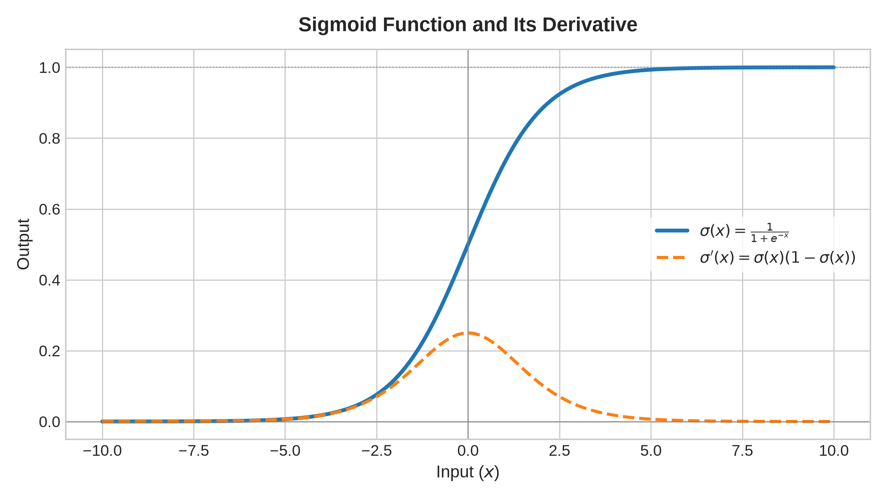

# Machine Learning Notes: Activation Functions

## 1. Sigmoid Function

The standard logistic sigmoid function maps any real-valued number into the open interval $(0, 1)$:

$$\sigma(x) = \frac{1}{1 + e^{-x}}$$

### Mathematical Properties
* **Range:** $0 < \sigma(x) < 1$
* **Symmetry:** $\sigma(-x) = 1 - \sigma(x)$
* **Derivative:** 
  $$\sigma'(x) = \sigma(x)(1 - \sigma(x))$$

### Visualization

> **Vanishing Gradient Issue:** Notice that for $|x| > 4$, the derivative $\sigma'(x) \to 0$. In deep neural networks, this causes gradient backpropagation signals to vanish rapidly.
